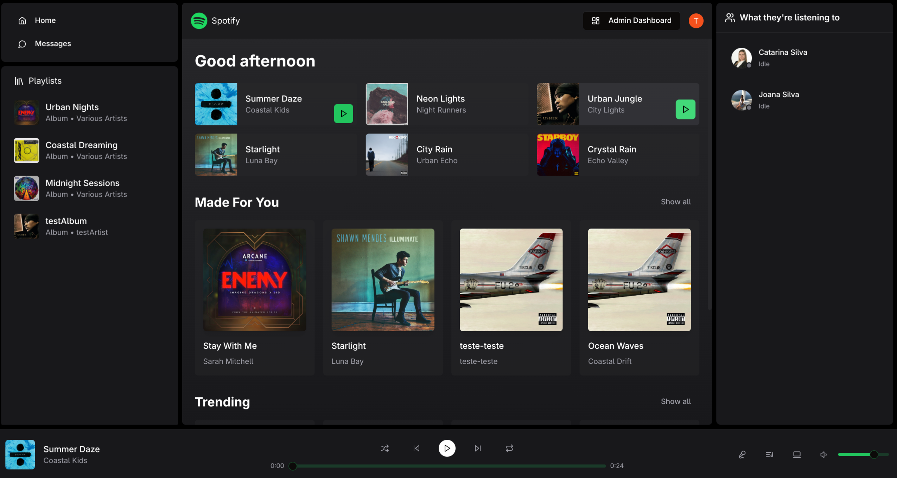
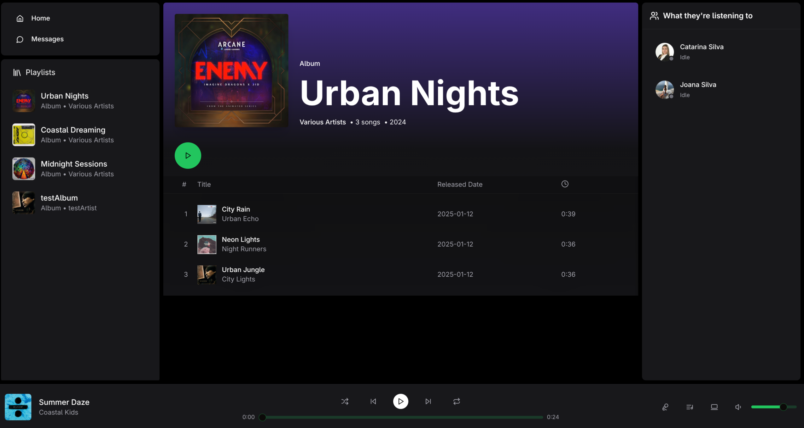
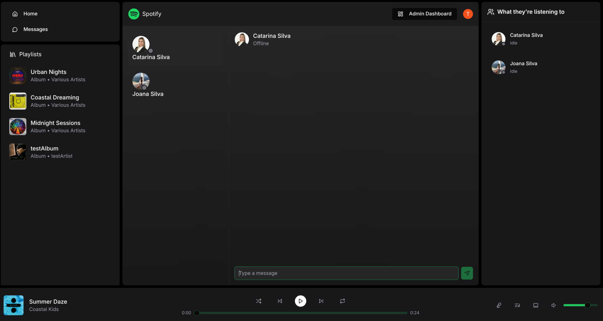
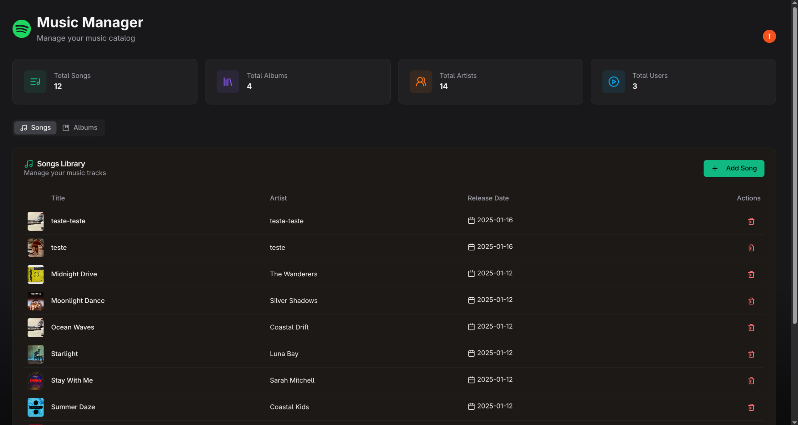

# Spotify Clone

A full-stack music streaming application inspired by Spotify, built with modern web technologies. This project features user authentication, music playback, real-time chat, album management, and an admin dashboard for content management.

## Table of Contents

- [Introduction](#introduction)
- [Features](#features)
- [Technologies](#technologies)
- [Project Structure](#project-structure)
- [Getting Started](#getting-started)
- [Project Flow](#project-flow)
- [API Endpoints](#api-endpoints)
- [Environment Variables](#environment-variables)
- [Scripts](#scripts)

## Introduction

This Spotify clone is a comprehensive music streaming platform that replicates core features of the popular music service. The application consists of a React-based frontend and a Node.js/Express backend, providing users with a seamless music listening experience.

### Screenshots

#### Main Dashboard


The main dashboard serves as the home page where users can discover music. It features:
- **Featured Section**: Highlights popular and trending songs
- **Made for You**: Personalized song recommendations
- **Trending Songs**: Currently popular tracks
- **Album Grid**: Browse available albums
- **Audio Player**: Persistent player at the bottom for continuous playback
- **Left Sidebar**: Navigation menu with quick access to different sections
- **Friends Activity**: Real-time updates on what friends are listening to

#### Albums Page


The albums page displays all available albums in a grid layout. Users can:
- Browse through album covers
- Click on any album to view its details and tracklist
- See album artwork and metadata
- Navigate to individual album pages to play songs

#### Messages/Chat


The chat feature enables real-time communication between users:
- **Users List**: Sidebar showing all registered users
- **Chat Interface**: Main messaging area with message history
- **Real-time Updates**: Messages are delivered instantly using Socket.IO
- **User Presence**: See which users are online
- **Message Input**: Send messages to selected users

#### Admin Dashboard


The admin dashboard provides comprehensive content management:
- **Statistics Overview**: Total songs, albums, users, and artists
- **Songs Management**: View, add, and delete songs
- **Albums Management**: Manage album collections
- **Data Tables**: Sortable and filterable tables for easy content management
- **Upload Functionality**: Add new songs and albums with file uploads
- **Cloudinary Integration**: Automatic image and audio file hosting

## Features

- 🔐 **Authentication**: Secure user authentication using Clerk
- 🎵 **Music Playback**: Full-featured audio player with play/pause, seek, and volume control
- 📱 **Real-time Chat**: Socket.IO-powered messaging system
- 🎨 **Album Management**: Browse and manage music albums
- 👥 **User Profiles**: User profiles with avatars
- 🎛️ **Admin Panel**: Comprehensive admin dashboard for content management
- 📊 **Statistics**: Dashboard with platform statistics
- 🎯 **Personalized Content**: Featured songs, trending tracks, and personalized recommendations
- 📁 **File Upload**: Upload songs and album covers with Cloudinary integration
- 🔄 **Real-time Updates**: Live updates for friend activity and chat

## Technologies

### Frontend

- **React 18.3.1**: UI library
- **TypeScript**: Type-safe JavaScript
- **Vite**: Build tool and dev server
- **React Router DOM 6.28.1**: Client-side routing
- **Zustand 5.0.3**: State management
- **Axios 1.7.9**: HTTP client
- **Socket.IO Client 4.8.1**: Real-time communication
- **Clerk React 5.21.2**: Authentication
- **Tailwind CSS 3.4.17**: Utility-first CSS framework
- **Radix UI**: Accessible component primitives
  - Avatar, Dialog, Scroll Area, Select, Slider, Tabs
- **Lucide React**: Icon library
- **React Hot Toast**: Toast notifications
- **React Resizable Panels**: Resizable layout panels

### Backend

- **Node.js**: JavaScript runtime
- **Express 4.21.2**: Web framework
- **Mongoose 8.9.4**: MongoDB ODM
- **Socket.IO 4.8.1**: Real-time bidirectional communication
- **Clerk Express 1.3.33**: Backend authentication middleware
- **Cloudinary 2.5.1**: Cloud-based image and video management
- **Express FileUpload 1.5.1**: File upload handling
- **CORS 2.8.5**: Cross-origin resource sharing
- **Node Cron 3.0.3**: Task scheduler for cleanup jobs
- **Dotenv 16.4.7**: Environment variable management

### Database

- **MongoDB**: NoSQL database for storing users, songs, albums, and messages

### Cloud Services

- **Cloudinary**: Media storage and CDN for images and audio files
- **Clerk**: Authentication and user management service

## Project Structure

```
spotify-clone/
├── backend/
│   ├── src/
│   │   ├── controllers/     # Route controllers
│   │   │   ├── admin.controller.js
│   │   │   ├── album.controller.js
│   │   │   ├── auth.controller.js
│   │   │   ├── song.controller.js
│   │   │   ├── stat.controller.js
│   │   │   └── user.controller.js
│   │   ├── lib/              # Utilities and configurations
│   │   │   ├── cloudinary.js
│   │   │   ├── db.js
│   │   │   └── socket.js
│   │   ├── middleware/       # Express middleware
│   │   │   └── auth.middleware.js
│   │   ├── models/           # Mongoose models
│   │   │   ├── album.model.js
│   │   │   ├── message.model.js
│   │   │   ├── song.model.js
│   │   │   └── user.model.js
│   │   ├── routes/           # API routes
│   │   │   ├── admin.route.js
│   │   │   ├── album.route.js
│   │   │   ├── auth.route.js
│   │   │   ├── song.route.js
│   │   │   ├── stat.route.js
│   │   │   └── user.route.js
│   │   ├── seeds/            # Database seeders
│   │   │   ├── albums.js
│   │   │   └── songs.js
│   │   └── index.js          # Entry point
│   └── package.json
├── frontend/
│   ├── src/
│   │   ├── components/       # Reusable components
│   │   │   ├── ui/           # UI primitives (shadcn/ui)
│   │   │   └── skeletons/    # Loading skeletons
│   │   ├── layout/           # Layout components
│   │   │   ├── components/   # AudioPlayer, Sidebar, etc.
│   │   │   └── MainLayout.tsx
│   │   ├── pages/            # Page components
│   │   │   ├── admin/        # Admin dashboard
│   │   │   ├── album/        # Album detail page
│   │   │   ├── auth-callback/ # Auth callback handler
│   │   │   ├── chat/         # Chat page
│   │   │   ├── home/         # Home page
│   │   │   └── 404/          # Not found page
│   │   ├── providers/        # Context providers
│   │   │   └── AuthProvider.tsx
│   │   ├── stores/           # Zustand stores
│   │   │   ├── useAuthStore.ts
│   │   │   ├── useChatStore.ts
│   │   │   ├── useMusicStore.ts
│   │   │   └── usePlayerStore.ts
│   │   ├── lib/              # Utilities
│   │   │   ├── axios.ts
│   │   │   └── utils.ts
│   │   ├── types/            # TypeScript types
│   │   │   └── index.ts
│   │   ├── App.tsx           # Main app component
│   │   └── main.tsx          # Entry point
│   └── package.json
└── README.md
```

## Getting Started

### Prerequisites

- Node.js (v18 or higher)
- MongoDB database
- Clerk account (for authentication)
- Cloudinary account (for media storage)

### Installation

1. Clone the repository:
```bash
git clone https://github.com/tiagosousa10/spotify-clone.git
cd spotify-clone
```

2. Install dependencies:
```bash
# Install root dependencies
npm install

# Install backend dependencies
cd backend
npm install

# Install frontend dependencies
cd ../frontend
npm install
```

3. Set up environment variables:

Create a `.env` file in the `backend` directory:
```env
PORT=5000
MONGODB_URI=your_mongodb_connection_string
CLERK_SECRET_KEY=your_clerk_secret_key
CLOUDINARY_CLOUD_NAME=your_cloudinary_cloud_name
CLOUDINARY_API_KEY=your_cloudinary_api_key
CLOUDINARY_API_SECRET=your_cloudinary_api_secret
NODE_ENV=development
```

4. Set up Clerk:

- Create a Clerk application
- Configure OAuth providers (Google, GitHub, etc.)
- Set redirect URLs:
  - `http://localhost:3000/sso-callback`
  - `http://localhost:3000/auth-callback`

5. Seed the database (optional):
```bash
cd backend
npm run seed:songs
npm run seed:albums
```

6. Run the application:

Development mode:
```bash
# Terminal 1 - Backend
cd backend
npm run dev

# Terminal 2 - Frontend
cd frontend
npm run dev
```

Production mode:
```bash
# Build frontend
npm run build

# Start backend (serves frontend in production)
npm start
```

The application will be available at:
- Frontend: `http://localhost:3000`
- Backend API: `http://localhost:5000`

## Project Flow

### Authentication Flow

1. User clicks "Sign In" button
2. Clerk handles OAuth authentication (Google, GitHub, etc.)
3. After successful authentication, user is redirected to `/auth-callback`
4. Frontend sends user data to backend `/api/auth/callback`
5. Backend checks if user exists in database (by `clerkId`)
6. If new user, creates user record in MongoDB
7. Frontend initializes Socket.IO connection with user ID
8. User is redirected to home page

### Music Playback Flow

1. User browses songs on home page or album page
2. User clicks play button on a song
3. `usePlayerStore` updates current song state
4. `AudioPlayer` component loads and plays the audio
5. Playback controls (play/pause, seek, volume) update the player state
6. Current song information is displayed in the player
7. Friends can see what the user is listening to via Socket.IO

### Chat Flow

1. User navigates to `/chat` page
2. Frontend fetches all users from `/api/users`
3. Socket.IO connection is established (if not already)
4. User selects a user from the list
5. Frontend fetches message history from `/api/users/:userId/messages`
6. User types and sends a message
7. Message is sent to backend via Socket.IO
8. Backend broadcasts message to recipient
9. Both users see the message in real-time

### Admin Flow

1. User with admin privileges navigates to `/admin`
2. Frontend checks admin status via `/api/admin/check`
3. Admin dashboard displays statistics and content tables
4. Admin can:
   - View all songs and albums
   - Add new songs/albums (with file uploads)
   - Delete songs/albums
   - View platform statistics

### File Upload Flow

1. Admin selects files (image for album cover, audio for song)
2. Files are uploaded to backend via `express-fileupload`
3. Backend temporarily stores files in `tmp/` directory
4. Files are uploaded to Cloudinary
5. Cloudinary returns URLs for the uploaded files
6. URLs are stored in MongoDB
7. Temporary files are cleaned up by cron job (runs every hour)

## API Endpoints

### Authentication
- `POST /api/auth/callback` - Sync user data after Clerk authentication

### Users
- `GET /api/users` - Get all users
- `GET /api/users/:userId/messages` - Get messages with a user

### Songs
- `GET /api/songs` - Get all songs
- `GET /api/songs/featured` - Get featured songs
- `GET /api/songs/made-for-you` - Get personalized songs
- `GET /api/songs/trending` - Get trending songs

### Albums
- `GET /api/albums` - Get all albums
- `GET /api/albums/:albumId` - Get album by ID

### Admin
- `GET /api/admin/check` - Check if user is admin
- `GET /api/admin/songs` - Get all songs (admin)
- `POST /api/admin/songs` - Create new song
- `DELETE /api/admin/songs/:songId` - Delete song
- `GET /api/admin/albums` - Get all albums (admin)
- `POST /api/admin/albums` - Create new album
- `DELETE /api/admin/albums/:albumId` - Delete album

### Statistics
- `GET /api/stats` - Get platform statistics

## Environment Variables

### Backend (.env)

| Variable | Description |
|----------|-------------|
| `PORT` | Server port (default: 5000) |
| `MONGODB_URI` | MongoDB connection string |
| `CLERK_SECRET_KEY` | Clerk secret key for backend |
| `CLOUDINARY_CLOUD_NAME` | Cloudinary cloud name |
| `CLOUDINARY_API_KEY` | Cloudinary API key |
| `CLOUDINARY_API_SECRET` | Cloudinary API secret |
| `NODE_ENV` | Environment (development/production) |

### Frontend

Clerk configuration is handled through environment variables or Clerk dashboard settings:
- `VITE_CLERK_PUBLISHABLE_KEY` - Clerk publishable key (if using .env)

## Scripts

### Root
- `npm run build` - Install dependencies and build frontend
- `npm start` - Start backend server

### Backend
- `npm run dev` - Start development server with nodemon
- `npm start` - Start production server
- `npm run seed:songs` - Seed database with songs
- `npm run seed:albums` - Seed database with albums

### Frontend
- `npm run dev` - Start Vite development server
- `npm run build` - Build for production
- `npm run preview` - Preview production build
- `npm run lint` - Run ESLint

## License

ISC

## Author

Tiago Sousa

## Repository

[GitHub Repository](https://github.com/tiagosousa10/spotify-clone)
